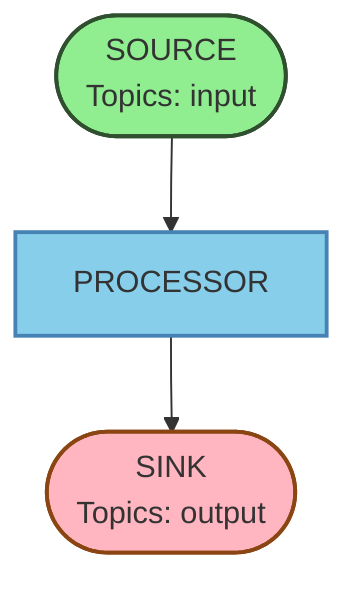
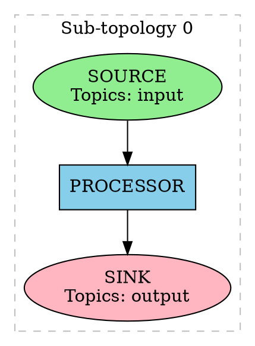

# Kafka Streams Topology Visualizer

A Java library and command-line tool for visualizing Kafka Streams topologies in various formats such as [Mermaid](https://mermaid.js.org/) flowcharts and [GraphViz](https://graphviz.org/) DOT files.

## Features

- 📊 **Multiple Output Formats**: Generate Mermaid flowcharts and GraphViz DOT files
- 🎨 **Node Styling**: Different visual styles for sources, processors, sinks, and global stores
- 🔗 **Connected Subtopologies**: Automatically detects and visualizes connections between subtopologies via intermediate topics
- 📥 **Flexible Input**: Support for both TopologyDescription API and text representation
- 🔧 **Library & CLI**: Use as a library in your application or as a standalone CLI tool
- ⚡ **GraalVM Native Image**: Build as a static binary for instant startup and low memory usage
- 🔌 **Extensible**: Easy to add new output formatters

## Requirements

- Java 17 or higher

## Building

### Standard JAR Build

```bash
./mvnw clean package
```

This creates two JAR files in the `target/` directory:
- `kafka-streams-topology-viz-1.0.0-SNAPSHOT.jar` - Library JAR
- `kafka-streams-topology-viz-1.0.0-SNAPSHOT-cli.jar` - Executable CLI JAR

### GraalVM Native Image Build

Build a native executable using GraalVM for faster startup and lower memory usage:

**Prerequisites:**
- [GraalVM](https://www.graalvm.org/) 21+ with `native-image` installed
- Set `JAVA_HOME` to GraalVM installation

```bash
# Build native executable
./mvnw clean package -Pnative

# The native executable will be created at:
# target/kafka-streams-topology-viz
```

**Benefits of Native Image:**
- ⚡ **Instant startup** - No JVM warmup time
- 💾 **Low memory footprint** - Typically 10-20x less than JVM
- 📦 **Single binary** - No Java runtime required
- 🚀 **Fast execution** - Ahead-of-time compiled

**Usage:**
```bash
# Run the native executable directly
./target/kafka-streams-topology-viz topology.txt

# Or install it to your PATH
sudo cp target/kafka-streams-topology-viz /usr/local/bin/
kafka-streams-topology-viz topology.txt
```

## Usage

### Command-Line Interface

The CLI can read topology descriptions from files or stdin and output to stdout or files.

#### Basic Usage

```bash
# Convert topology text file to Mermaid (default)
java -jar kafka-streams-topology-viz-1.0.0-SNAPSHOT-cli.jar topology.txt

# Convert to GraphViz DOT format
java -jar kafka-streams-topology-viz-1.0.0-SNAPSHOT-cli.jar -f dot topology.txt

# Read from stdin
cat topology.txt | java -jar kafka-streams-topology-viz-1.0.0-SNAPSHOT-cli.jar -

# Write output to file
java -jar kafka-streams-topology-viz-1.0.0-SNAPSHOT-cli.jar -o output.mmd topology.txt

# List available formats
java -jar kafka-streams-topology-viz-1.0.0-SNAPSHOT-cli.jar --list-formats

# Show help
java -jar kafka-streams-topology-viz-1.0.0-SNAPSHOT-cli.jar --help
```

#### CLI Options

- `INPUT` - Input file path or `-` for stdin (required)
- `-f, --format <FORMAT>` - Output format: `mermaid` or `dot` (default: `mermaid`)
- `-o, --output <FILE>` - Output file path (default: stdout)
- `-l, --list-formats` - List available output formats
- `-h, --help` - Show help message
- `-V, --version` - Show version information

### Library API

Add the library as a dependency to your project:

```xml
<dependency>
    <groupId>com.github.joschi</groupId>
    <artifactId>kafka-streams-topology-viz</artifactId>
    <version>1.0.0-SNAPSHOT</version>
</dependency>
```

#### Using TopologyDescription API

```java
import com.github.joschi.kafka.topology.converter.TopologyConverter;
import org.apache.kafka.streams.StreamsBuilder;
import org.apache.kafka.streams.Topology;
import org.apache.kafka.streams.TopologyDescription;

// Create your Kafka Streams topology
StreamsBuilder builder = new StreamsBuilder();
builder.stream("input-topic")
       .filter((key, value) -> value != null)
       .to("output-topic");
Topology topology = builder.build();
TopologyDescription description = topology.describe();

// Convert to visualization format
TopologyConverter converter = new TopologyConverter();

// Generate Mermaid flowchart
String mermaid = converter.toMermaid(description);
System.out.println(mermaid);

// Generate GraphViz DOT file
String dot = converter.toDot(description);
System.out.println(dot);
```

#### Using Text Representation

```java
import com.github.joschi.kafka.topology.converter.TopologyConverter;

String topologyText = """
    Topologies:
       Sub-topology: 0
        Source: KSTREAM-SOURCE-0000000000 (topics: [input-topic])
          --> KSTREAM-FILTER-0000000001
        Processor: KSTREAM-FILTER-0000000001 (stores: [])
          --> KSTREAM-SINK-0000000002
          <-- KSTREAM-SOURCE-0000000000
        Sink: KSTREAM-SINK-0000000002 (topic: output-topic)
          <-- KSTREAM-FILTER-0000000001
    """;

TopologyConverter converter = new TopologyConverter();

// Convert to Mermaid
String mermaid = converter.toMermaidFromText(topologyText);

// Convert to DOT
String dot = converter.toDotFromText(topologyText);

// Generic conversion
String output = converter.convertFromText(topologyText, "mermaid");
```

#### Custom Formatters

You can register custom formatters to support additional output formats:

```java
import com.github.joschi.kafka.topology.formatter.TopologyFormatter;
import com.github.joschi.kafka.topology.model.Topology;

class CustomFormatter implements TopologyFormatter {
    @Override
    public String format(Topology topology) {
        // Your custom formatting logic
        return "custom output";
    }

    @Override
    public String getFormatName() {
        return "custom";
    }
}

// Register and use
TopologyConverter converter = new TopologyConverter();
converter.registerFormatter(new CustomFormatter());
String output = converter.formatTopology(topology, "custom");
```

## Output Formats

### Mermaid Flowchart

Generates a Mermaid flowchart with:
- **Top-down layout** (`flowchart TD`)
- **Color-coded nodes**:
  - 🟢 Sources: Green stadium shapes
  - 🔵 Processors: Blue rectangles
  - 🟣 Sinks: Pink stadium shapes
  - 🟡 Global Stores: Gold hexagons with dashed borders
- **Topic information** included in node labels
- **Subtopology grouping** via comments
- **Inter-subtopology connections** shown as dashed arrows with topic labels

Example output:


### GraphViz DOT

Generates a GraphViz DOT file with:
- **Top-down layout** (`rankdir=TD`)
- **Clustered subtopologies** (dashed gray boxes)
- **Shaped and colored nodes**:
  - 🟢 Sources: Green ellipses
  - 🔵 Processors: Blue boxes
  - 🟣 Sinks: Pink ellipses
  - 🟡 Global Stores: Gold hexagons with dashed borders
- **Topic information** in node labels
- **Inter-subtopology connections** shown as dashed purple arrows with topic labels

Example output:


You can render DOT files using:
```bash
dot -Tpng topology.dot -o topology.png
dot -Tsvg topology.dot -o topology.svg
```

## Project Structure

```
kafka-streams-topology-viz/
├── src/
│   ├── main/
│   │   └── java/com/github/joschi/kafka/topology/
│   │       ├── model/            # Internal topology model
│   │       ├── parser/           # Text parser
│   │       ├── converter/        # TopologyDescription converter & API
│   │       ├── formatter/        # Output formatters
│   │       └── cli/              # Command-line interface
│   └── test/
│       ├── java/                 # Unit tests
│       └── resources/            # Test resources
├── pom.xml
└── README.md
```

## Examples

### Complete Example

Given this topology text file (`topology.txt`):

```
Topologies:
   Sub-topology: 0
    Source: KSTREAM-SOURCE-0000000000 (topics: [input-topic])
      --> KSTREAM-MAPVALUES-0000000001
    Processor: KSTREAM-MAPVALUES-0000000001 (stores: [])
      --> KSTREAM-FILTER-0000000002
      <-- KSTREAM-SOURCE-0000000000
    Processor: KSTREAM-FILTER-0000000002 (stores: [])
      --> KSTREAM-SINK-0000000003
      <-- KSTREAM-MAPVALUES-0000000001
    Sink: KSTREAM-SINK-0000000003 (topic: output-topic)
      <-- KSTREAM-FILTER-0000000002
```

Convert to Mermaid:
```bash
java -jar kafka-streams-topology-viz-1.0.0-SNAPSHOT-cli.jar topology.txt > topology.mmd
```

Convert to DOT and render as PNG:
```bash
java -jar kafka-streams-topology-viz-1.0.0-SNAPSHOT-cli.jar -f dot topology.txt | dot -Tpng > topology.png
```

## Contributing

Contributions are welcome! To add a new output format:

1. Implement the `TopologyFormatter` interface
2. Register it with `TopologyConverter`
3. Add tests for your formatter

## License

This project is available under the Apache License 2.0.

## See Also

- [Apache Kafka Streams Documentation](https://kafka.apache.org/documentation/streams/)
- [Mermaid Documentation](https://mermaid.js.org/)
- [GraphViz Documentation](https://graphviz.org/documentation/)
